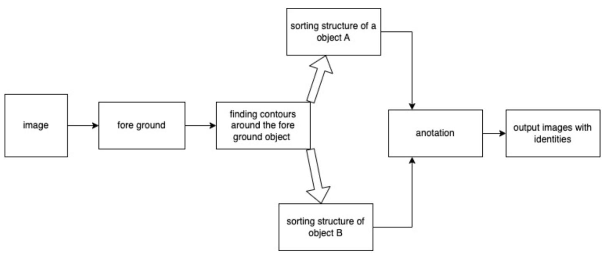

# Introduction:

Object identification like humans can be used in various methods.

## HOG transform

The histogram of oriented gradients (HOG) is a feature descriptor used in computer vision and image processing for the purpose of object detection. The technique counts occurrences of gradient orientation in localized portions of an image. This method is similar to that of edge orientation histograms, scale-invariant feature transform descriptors, and shape contexts, but differs in that it is computed on a dense grid of uniformly spaced cells and uses overlapping local contrast normalization for improved accuracy.
Robert K. McConnell of Wayland Research Inc. first described the concepts behind HOG without using the term HOG in a patent application in 1986.[1] In 1994 the concepts were used by Mitsubishi Electric Research Laboratories.[2] However, usage only became widespread in 2005 when Navneet Dalal and Bill Triggs, researchers for the French National Institute for Research in Computer Science and Automation (INRIA), presented their supplementary work on HOG descriptors at the Conference on Computer Vision and Pattern Recognition (CVPR). In this work they focused on pedestrian detection in static images, although since then they expanded their tests to include human detection in videos, as well as to a variety of common animals and vehicles in static imagery.

## Haars cascade classifier 

Cascading is a particular case of ensemble learning based on the concatenation of several classifiers, using all information collected from the output from a given classifier as additional information for the next classifier in the cascade. Unlike voting or stacking ensembles, which are multiexpert systems, cascading is a multistage one.
Cascading classifiers are trained with several hundred "positive" sample views of a particular object and arbitrary "negative" images of the same size. After the classifier is trained it can be applied to a region of an image and detect the object in question. To search for the object in the entire frame, the search window can be moved across the image and check every location with the classifier. This process is most commonly used in image processing for object detection and tracking, primarily facial detection and recognition.
The first cascading classifier was the face detector of Viola and Jones (2001). The requirement for this classifier was to be fast in order to be implemented on low-power CPUs, such as cameras and phones.

## Image characteristics based methods

Foreground detection is one of the major tasks in the field of computer vision and image processing whose aim is to detect changes in image sequences. Background subtraction is any technique which allows an image's foreground to be extracted for further processing (object recognition etc.).
Many applications do not need to know everything about the evolution of movement in a video sequence, but only require the information of changes in the scene, because an image's regions of interest are objects (humans, cars, text etc.) in its foreground. After the stage of image preprocessing (which may include image denoising, post processing like morphology etc.) object localisation is required which may make use of this technique.
Foreground detection separates foreground from background based on these changes taking place in the foreground. It is a set of techniques that typically analyze video sequences recorded in real time with a stationary camera.

## performance

Computational time for video based tracking 

- [x] HOGs method: 0.5s (2FPS)
- [x] Cascade Classifier : 0.2(5FPS)
- [x] MOG based method: 0.02(50FPS)
- [x] YOLO model:2-3FPS

## review
### Person only
- Few falls detections and detect people movements but there is size condition lager the better smaller the worst.(first :1-5)
- Next five clips has shown significant results but there are error prones
- yolo is better computationally expensive

### Vehicle only
- Worst case is 4th clip rest of other clips from 1 to 5 is fair condition
- able to detect but few error prones
- mog is fine but Hass classifier is worst
- YOLO is best but computation time is 400ms

### People with vehicle
- Worst is 5 and 1 has more error prone detection. Rest of 4,3,2 is ok
- can detect but some people with no motion unable to detect however human detection is errorsome
- hogs people detector consume more time and cannot identify 
- hass classifier has false result when there is occlusion in body
- mog can detect moving or dynamic object which is kind of cool compare with others

### Spacial case 
#### car park
- Video mog base method: False detect by animals no still vehicles detected
- haas classifier also not getting very much acceptable results in parking situation 4
- mog works well but there is shadow detection and hass cars classifier did not get acceptable results

### pipeline of MOG based method

To evaluate predefined structure to determine consecutive frames useful to have this hierarchy which is give some meaning to identity 
After getting a contour required to sort out the identity using hierarchy setting could be structured the defined contour 

